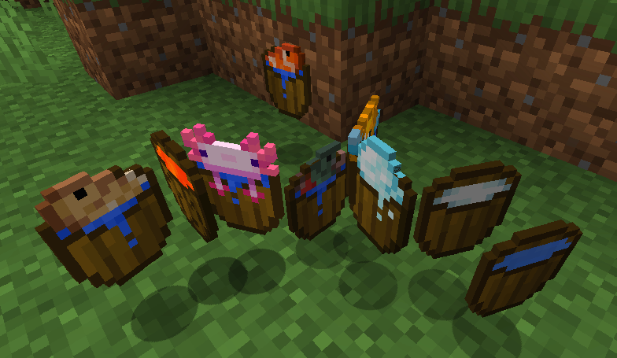

# Wooden Bucket 

[.svg)](https://www.curseforge.com/minecraft/mc-mods/wooden-bucket/files)
[.svg)](https://www.curseforge.com/minecraft/mc-mods/wooden-bucket)

 

This is a **Minecraft Forge** mod that adds a **Wooden Bucket** to the game.

The library mod [BucketLib](https://www.curseforge.com/minecraft/mc-mods/bucketlib) is required.

The **Wooden Bucket** acts like a normal bucket and can contain **water**, **lava**, **milk** **powder snow** and **axolotl**/**fish**.

Special features of a Wooden Bucket:
- If the bucket contains lava, it melts as soon as you empty it. (temperature configurable)
- It has a durability of 25. (configurable)
- Obtaining fluids, blocks & entities can be configured via tags and via configuration file.

All bucketable mod fluids, block & entities are supported. (see also [BucketLib Wiki](https://github.com/cech12/BucketLib/wiki/Developer-Guide#make-your-mod-compatible))

For more information, please check out the **Wiki**: https://github.com/cech12/WoodenBucket/wiki